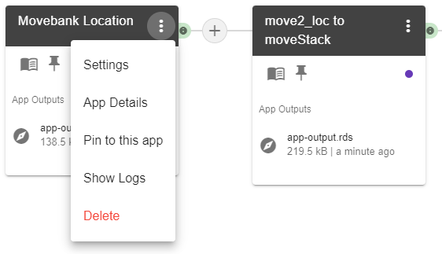

# Wie erstelle ich einen Workflow

Die in MoveApps verfügbaren Apps können in einem Workflow in Reihe zusammengefügt werden, um sie für eine spezifische Anwendung hintereinander auszuführen.

Jeder Workflow beginnt mit einer App, die Daten in den Server lädt  (z.B. Daten von Movebank oder aus einer Dropbox). Die Daten werden dann im passenden Format an die darauffolgenden Apps weitergegeben und analysiert. Jede App benötigt Input-Daten eines definierten Typs (derzeit nur Movement: Positionen mit Datum, Zeitpunkt und Individuum) und gibt Output-Daten eines definierten Typs (derzeit nur Movement) weiter bzw. endet mit einem interaktiven User Interface (RShiny).

Einige Apps produzieren zusätzlich Output-Artefakte, die als Dateien z.B. vom Typ .pdf oder .csv, heruntergeladen werden können. Auch der Movement-Daten-Output kann heruntergeladen werden (in R-Format '.rds').

## Neuen Workflow erstellen
Im Menü `Workflows` kann ein neuer Workflow unter `Create New Workflow` erstellt werden. Nach der Vergabe eines Namens für diesen Workflow muss eine `Data Source` gewählt werden, derzeit entweder Movebank Download oder Download vom persönlichen Cloud-Speicher auf Google Drive oder Dropbox. Bei beiden Apps müssen dann verschiedene Parameter eingestellt werden. Nachdem dies fertiggestellt ist, erscheint die Workflow-Oberfläche mit einer ersten App (siehe Abbildung). Es ist möglich, durch Hinzufügen z.B. weiterer Movebank download Apps, mehrere Datensätze herunterzuladen (siehe unten). Die Datensätze werden automatisch zusammengefügt, was danach die gemeinsame Analyse verschiedener Daten, z.B. aus mehreren Movebank-Studien, erlaubt.

## Workflow zusammenfügen
Durch klicken auf das „+“ können zusätzliche Apps ausgewählt werden, die die vorher heruntergeladenen Daten filtern, analysieren oder visualisieren. Es können auch Apps zwischen zwei vorhandene Apps im Workflow eingefügt werden, wenn sie vom passenden Typ sind (in der Regel input: Movement und output: Movement). Daher werden in der Auswahlliste jeweils nur solche Apps angezeigt, die für die spezifische Position im Workflow vom passenden Typ sind. In der Auswahlliste `Choose an App` werden die Beschreibungen der Apps angezeigt und zusätzliche Angaben sind durch einen Klick auf `Details` einsehbar. Oben rechts kann die Liste anhand von Suchbegriffen gefiltert werden.

## Workflow laufen lassen
Der fertiggestellte Workflow kann mit `Start Workflow` gestartet werden. Dadurch werden die Apps nacheinander gestartet und ausgeführt. Dies ist durch die Farbänderung der Punkte in jedem App-Container (rechts unten) zu verfolgen. Der Workflow läuft auch weiter, wenn die Seite moveapps.org verlassen wird, und Ergebnisse können später angeschaut bzw. heruntergeladen werden. Mit `Rerun` oder `Stop Workflow` kann der Workflow-Lauf neu gestartet bzw. gestoppt werden. Jeder Workflow, der nur einfache R-Apps enthält, kann automatisiert werden und zu einer festgelegten Zeit regelmäßig ausgeführt werden. Diese Option (`Schedule Instance`) kann im Workflow-Menü neben dem Button „Start Workflow“ gewählt werden. Dort kann der Workflow auch exportiert bzw. eine Weiterleitung zur [Veröffentlichung des Workflows](publish_workflow) ausgewählt werden.

## Menüs, Settings und Fehlermeldungen
In jedem App-Modul eines Workflows gibt es neben dem App-Namen ein App-Menü. Die R-Apps zeigen folgende Menü-Punkte:

	- Settings:  Die Parameter der App können erneut festgelegt und geändert werden
	- Show Downloads: Die verfügbaren Daten zum Herunterladen (Output, Artefakte, Metadaten, Daten-Zusammenfassung) werden aufgelistet
	- Pin to this App: Der Output der App wird im Workflow fixiert, so dass beim erneuten Ausführen des Workflows nur die hinteren Apps neu ausgeführt werden. Die App, auf der gepinnt wird und alle vorherigen Apps werden grau unterlegt. Das `Pin` kann, durch Klicken auf `unpin` im unteren Teil der grauen Unterlage, jederzeit wieder aufgehoben werden.
	- Show Logs: Die Datenprotokolle können eingesehen werden. Besonders bei unerwarteten Ergebnissen oder Fehlermeldungen ist es wichtig diese zu konsultieren!
	- Delete: Löscht die App aus dem Workflow heraus.

## Datenübersicht des App-Output
Jede App, die Daten ausgibt, erstellt eine kurze Zusammenfassung dieser Daten, auf die über den erscheinenden, grünen Knopf an der rechten Seite des App-Containers zugegriffen werden kann. Hier wird die Bounding Box und der Zeitraum der Positionen gegeben, sowie die Anzahl verschiedener Tiere, die Gesamtzahl der Positionen (Events) und die Anzahl der Positionen für jedes Tier. Schließlich werden noch die Namen aller im Datensatz verfügbaren Variablen aufgelistet. Diese Zusammenfassung kann auch als Datei heruntergeladen werden.

## Shiny-R und User Interfaces
Für R-Shiny-Apps, die ein User Interface ausgeben (UI), kann dieses nach Ende des Durchlaufs des Workflows über `Open Results` oder `Shiny UI` im App-Menu erreicht werden. Dort können Settings direkt variiert und interaktiv Daten untersucht werden, jeweils abhängig von den Optionen, die der App-Entwickler vorgesehen hat. Es gibt auch R-Shiny-Apps, die Daten als Output haben und das UI z.B. zum Filtern der Daten nutzen. Für diese Apps kann auf das UI nur über `Shiny UI` im App-Menu zugegriffen werden.

## Workflow-Instanzen
Jeder Workflow kann in mehreren Instanzen ausgeführt und gespeichert werden. D.h. dieselben Apps sind in gleicher Reihenfolge hintereinandergeschaltet, nur ihre Settings unterscheiden sich. Es ist wichtig anzumerken, dass die Änderung der App-Zusammensetzung in einer Instanz eines Workflows sich auch auf alle anderen Instanzen des Workflows auswirkt, also dorthin automatisch übertragen wird.

Jede zusätzliche Workflow-Instanz muss in der Workflow-Übersicht im gewünschten Workflow über `Start new Instance` angelegt werden. Im dortigen Menü jeder Workflow-Instanz kann die Beschreibung angepasst werden (`Edit Workflow Instance Details`) und die Instanz gelöscht werden. Auch die Beschreibung des Workflows kann in diesem Menü geändert werden, bzw. der Workflow kann gelöscht werden.

