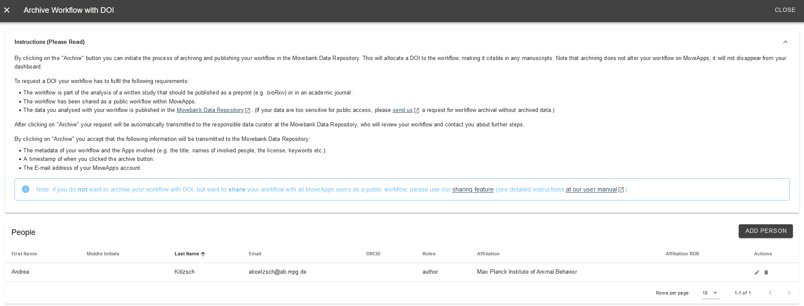
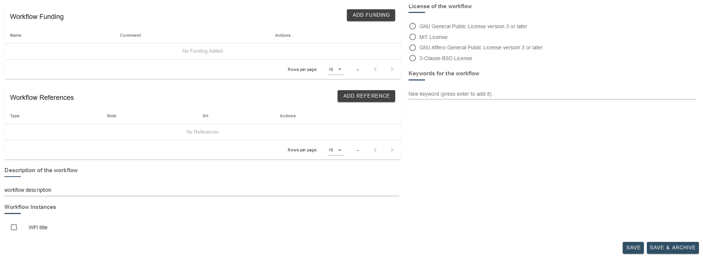

# Archive with DOI/ Publication of Workflows

To make your work reproducible, we offer the archival with DOI/publication of Workflows in combination with published papers and data sets.

## Archive with DOI
If you plan a publication of your Workflow in a scientific paper or a manuscript on bioRxiv, there is the additional option of acquiring a DOI (Digital Object Identifier) for your Workflow. Thereby, your Workflow will become permanently reproducible. The provision of a DOI is arranged by the Communication, Information and Media Centre (KIM) of the University of Konstanz and requires the archival of the related data in the [Movebank Data Repository](https://www.datarepository.movebank.org/). Please contact [mdr.kim@uni-konstanz.de](mdr.kim@uni-konstanz.de).

## How to archive your Workflow
In order to have all the required information for the archival of a Workflow gathered, please complete the `Archive with DOI` dialog that you can access via the Workflow menu in the Workflow overview. Carefully follow the provided instructions and select Workflow instances to be included. Once you are finished press `Save & Publish` and a message with all relevant information will be sent to our data repository and we will come back to you about it personally. Please add the archived Workflow also into the list of publicly shared Workflows by using the `Share` option, this is a requirement for publication, as it ensures future reproducibility. Archived and publicly shared Workflows are fixed and available with the original versions of all included Apps, i.e. they can be run as originally contributed. Apps can be updated if users have added public Workflows to their dashboard.

<kbd>
</kbd>

## Information required for Publication
For archiving your Workflow with a DOI, information about the Workflow, included Apps, licenses, authors, funding, references and other properties are required. All properties of the Apps are automatically taken from the App submission properties and the [appspec.json](appspec.md). In addition, you need to provide the following information at DOI publication, if not already provided at the initiation of the Workflow/Workflow Instance.

#### Workflow title
Please name your Workflow with a meaningful title. This will help other users to understand the scope of and the idea behind your Workflow.

#### Workflow description
Please write a detailed description of the Workflow, what you have created it for, how and why the Apps and their settings were chosen and which conclusions you draw from the results. Also add suggestions for further use and point out possible limitations.

#### Workflow instance title & description
You can include one or several instances of your Workflow in an archived Workflow. Please name each of those with a meaningful title as well as enrich it with a description. You can use this description to let people know how each of your instance configurations differ from one another.

#### Workflow contributors (people)
List the names and affiliations of all authors and other contributors to the Workflow. Each person can have one or more different [roles](people_appspec.md).

#### Workflow funding
Please list the funding sources that have supported you while developing your Workflow.

#### Workflow references
Please list all main references that you have used and will need for further work with your Workflow publication. See for possible [Reference types](references_appspec.md).

#### License
Choose a license under which you want to share/archive/publish your Workflow and which users of it must abide to. See our [recommendations](license.md) as help for your selection.

#### Keywords
Add a list of keywords that describe your Workflow so that it can easily be found by other users.

